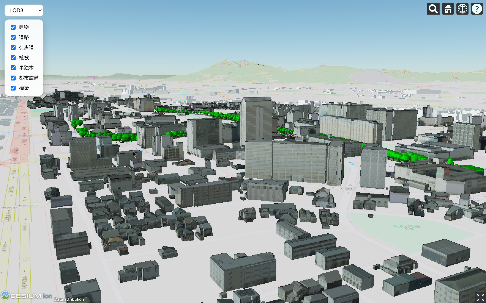
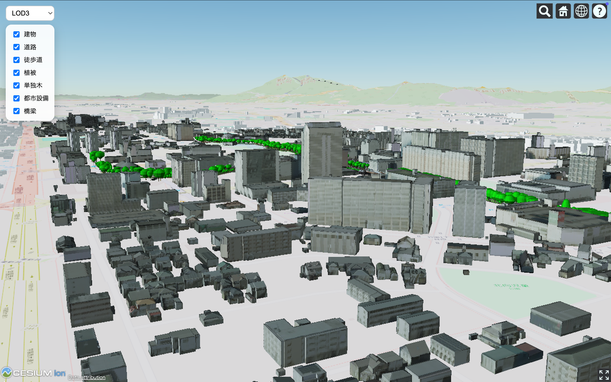

# 🏙️ PLATEAU 3Dモデルビューア（つくば市）

## 🚀 概要（Overview）
本プロジェクトは、国土交通省のオープンデータ「PLATEAU」を活用し、**つくば市の3D都市モデルをWebブラウザ上で閲覧できるビューア**です。  
LOD（Level of Detail）切り替えや、道路・植生などのレイヤー表示を自由にオン/オフでき、直感的に3D都市空間を探索できます。  

開発を通じて、3D都市データの活用、Cesiumによる3Dレンダリング、Web UI設計を実装しました。

---

## ✨ 主な機能（Features）
| 機能 | 説明 |
|-------|-------|
| 🔁 **LOD切り替え（LOD1 / LOD2 / LOD3）** | 建物モデルの詳細度を変更して軽量表示と高精細表示を切替可能 |
| 🧩 **レイヤーON/OFF切替** | 道路（tran）、歩行者道（trk）、植生（veg）、都市設備（frn）、橋梁（brid）など表示の制御 |
| 🗺️ **3D都市モデル表示（PLATEAU）** | 国土交通省が公開する3D都市モデル（CityGML）をCesiumで表示 |
| 🎛️ **UI付き（セレクタ & トグル）** | 画面上のUIで操作可能（ズーム イン/アウト、移動など含む）|
| 💡（任意拡張）地図スタイル変更・影や光の調整 | 見やすさ向上のためのビジュアル調整が可能 |

---

## 🖥️ デモ（Screenshots）
### 画面１

### 画面２

---

## 🧪 実行方法（Quick Start）
### ▶️ Step 1：ローカルサーバーを起動
HTMLはローカルで直接開くと動作制限があるため、簡易サーバーで起動します：
python3 -m http.server 8080
### ▶️ Step 2：ブラウザでアクセス
ブラウザで以下を開きます：
http://localhost:8080

## 🧱 ディレクトリ構成（Project Structure）

📦 Project Root
│
├─ index.html        # 画面の土台・UI配置・各JSファイルの読み込み
├─ style.css         # UIや見た目のスタイル（色・位置・デザイン）
│
├─ config.js         # 3DモデルURLや設定値を管理（変更しやすい設計）
├─ utils.js          # 共通で使う関数を定義（色付けやTileset読み込み等）
├─ app.js            # Cesiumの初期化処理（地形・背景・カメラ設定）
├─ layers.js         # 道路/植生/橋梁などのレイヤー表示制御
└─ ui.js             # UI操作イベント（LOD切替、チェックボックス制御など）

